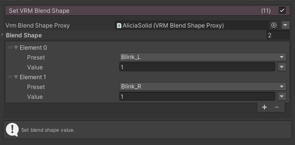
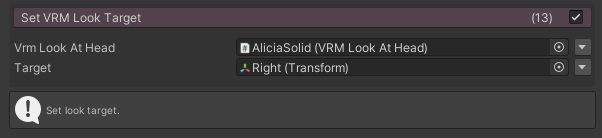

# FungusVRM

FungusからVRMを操作するコマンド

## Requirements

- Unity 2020.2.0b2
- [Fungus v3.13.7](https://github.com/snozbot/fungus)
- [UniVRM v0.87.0](https://github.com/vrm-c/UniVRM)

## Git Path (Unity Package Manager)

> https://github.com/kuro3vn-gme/FungusVRM.git?path=Assets/FungusVRM

## Commands

### SetVRMBlendShape

VRMモデルのブレンドシェイプの値を変更します。

### SetVRMLookTarget

VRMモデルの視線のターゲットを変更します。

